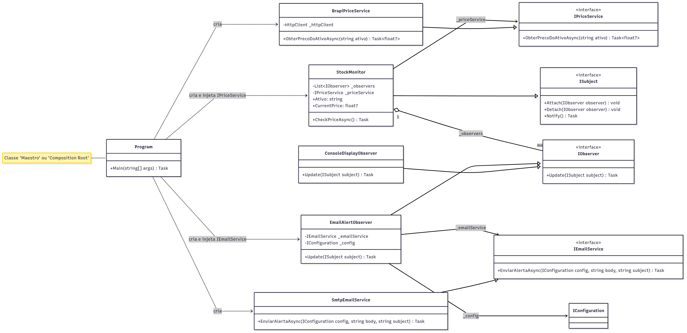

# Stock Quote Alert

Este é um programa de console que monitora a cotação de um ativo da B3 e envia um alerta por email quando o preço atinge limites definidos pelo usuário.

## Pré-requisitos

* [.NET 9 SDK](https://dotnet.microsoft.com/download/dotnet/9.0) (ou superior)

## Como Configurar e Executar

1.  **Clone o repositório:**
    ```sh
    git clone https://github.com/hugo-antunes19/Case-INOA.git
    cd Case-INOA/ConsoleApp
    ```

2.  **Configure seu arquivo `config.json`:**
    
    O arquivo config.json terá esse formato, altere os espaços ```SenderEmail``` para o endereço de email do remetente, adicione sua senha no ```SenderPassword``` e, por fim, altere o camo ```Recipients``` para os destinatários desejados.

    ```c
    {
    "SmtpSettings": {
        "Host": "smtp.gmail.com",
        "Port": 587,
        "SenderEmail": "seuemail@exemplo.com",
        "SenderPassword": "SUA SENHA AQUI"
    },
    "Recipients": [
        "Recipients1@exemplo.com",
        "Recipients2@exemplo.com",
        "Recipients3@exemplo.com"
    ]
    }
    ```

    Você pode enviar para quantos destinatários achar interessante. Caso queira enviar para apenas uma pessoa, você terá algo assim: 
    
    ```c
    "Recipients": [
        "Recipients1@exemplo.com"
        ]
    ```

3.  **Compile o projeto:**
    Para garantir que todas as dependências foram baixadas e criar a versão final do programa, execute:
    ```sh
    dotnet publish -c Release --runtime win-x64
    ```

4.  **Execute o programa:**
    Navegue até a pasta onde o executável foi gerado e rode o programa passando os argumentos: `<ATIVO> <MAXIMO> <MINIMO>`.

    ```sh
    cd bin\Release\net9.0\win-x64\publish
    .\stock-quote-alert.exe PETR4 22.67 22.59
    ```
5. **Funcionalidade Extra:**
    Com o intuito de não haver spam de mensagens, um cooldown foi implementado na função para enviar o alerta por email. Por padrão, o cooldown é igual a 10 minutos, caso queira que seja diferente, basta executar o programa com o terceiro parâmetro igual ao tempo desejado em minutos.

    **Exemplo de Cooldown igual a 30 minutos:**

    ```
    .\stock-quote-alert.exe PETR4 22.67 22.59 30
    ```
---

### **Resumo do Fluxo para o Usuário**

Com essa estrutura, o fluxo que você descreveu funcionará perfeitamente:

1.  Usuário executa `git clone ...`.
2.  Navega até a pasta `ConsoleApp`.
3.  Abre o `config.json` e insere suas credenciais.
4.  Roda `dotnet publish -c Release --runtime win-x64`.
5.  Entra na pasta `bin\Release\net9.0\win-x64\publish`.
6.  Executa `.\stock-quote-alert.exe PETR4 22.67 22.59`.

# Bibliografia e Arquitetura

## Bibliografia
Este projeto foi realizado com instruções e documentações pautadas nas seguintes obras: 
1. Clean Code de Robert Cecil Martin (https://www.amazon.com.br/C%C3%B3digo-limpo-Robert-C-Martin/dp/8576082675)
2. Design Patterns de Erich Gamma (https://www.amazon.com/Design-Patterns-Elements-Reusable-Object-Oriented/dp/0201633612)
3. Site Refactoring Guru: https://refactoring.guru/design-patterns/observer

Esses autores foram utilizados para melhor abordagem do problema. Este repositório teve, ao decorrer do tempo, quatro versões distintas, mas todas funcionais.

### Primeira Versão

A primeira abordagem do problema foi muito simples, apenas algumas funções e um ```while ( true )``` para enviar os alertas conforme necessário.

Entretanto, surgiu a ideia de investigar padrões de projetos para uma melhor implementação e utilização dos recursos computacionais.


### Segunda Versão

Na segunda versão, descobri a utilização do ```async``` em C# implementei o padrão do Observer, além de consertar alguns possíveis problemas de memória, como a instância HTTP, que estava sendo criada uma nova toda vez que acessava a API.

Também foi implementado o ```catch { }``` para tratamento de exceções e erros que podem ocorrer, uma vez que gostaríamos que a aplicação fosse robusta a erros e problemas. Dessa forma, a ausência de internet, assim como a falha no serviço SMTP, não *quebra* a aplicação, ela continuará em execução até a normalização dos recursos de rede, como é possível visualizar nos logs de Testes. Toda a aplicação foi testada e pode ser estudada pelos logs gerados em ```Case-INOA/Testes/```.

Essa segunda versão foi, com certeza, a mais difícil de implementar, uma vez que refatorei o código por completo.


### Terceira Versão

Na terceira versão, implementei algumas funcionalidades extras que senti úteis, como o envio do email para mais de um destinatário e um Cooldown, para não haver spam de emails. Tudo sendo implementado de maneira opcional, ou seja, o usuário pode ou não utilizar esses recursos.


### Quarta Versão - Final

Enquanto pensava no problema e o que li sobre o padrão *Observer* na internet, encontrei algumas possíveis falhas de implementação e melhorias que poderiam ser feitas.


## Arquitetura

A Arquitetura final pode ser visualizada abaixo

